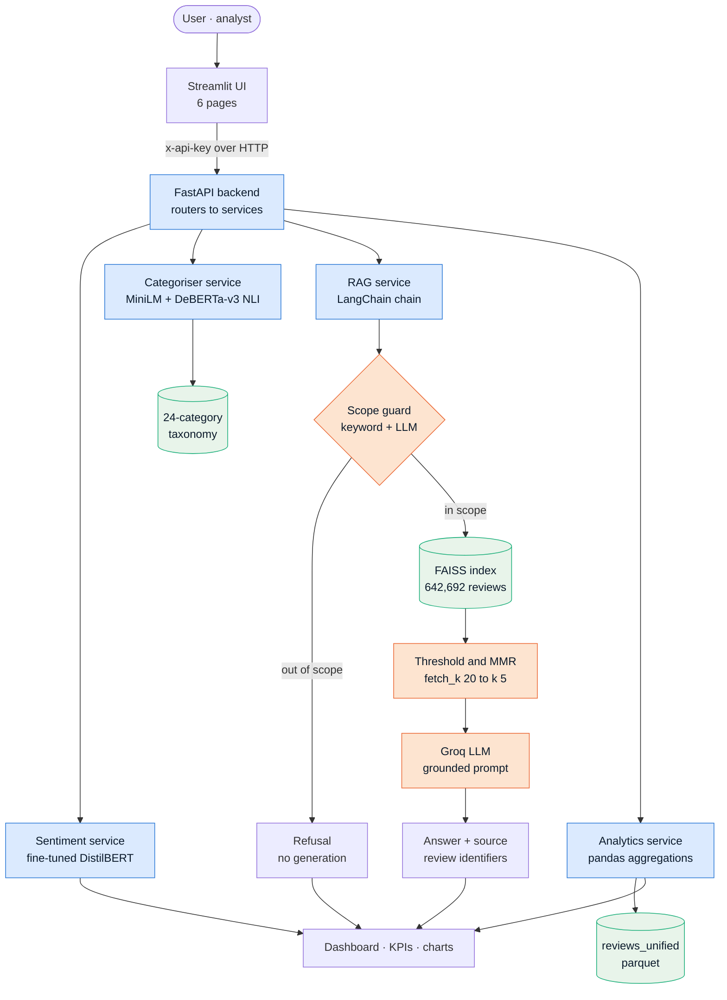
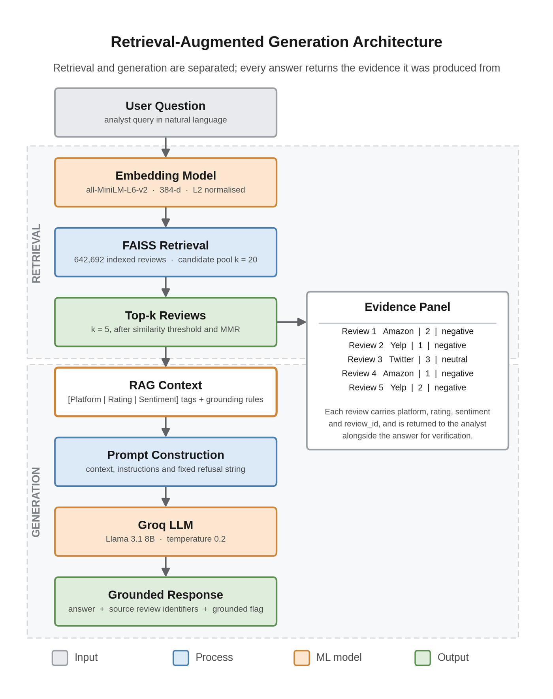
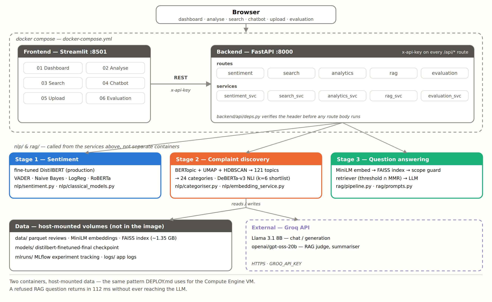
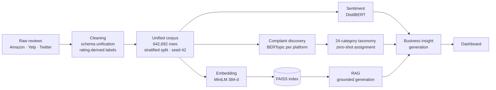
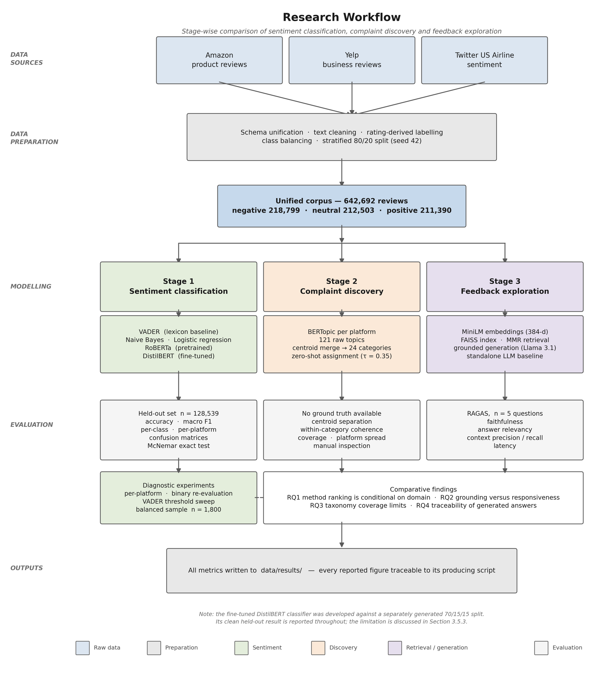
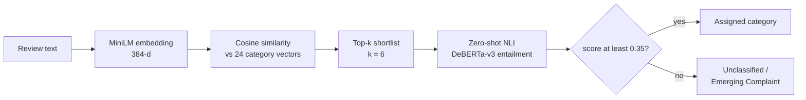
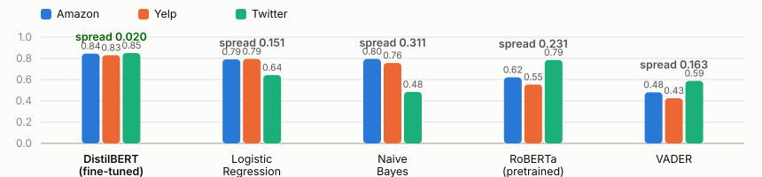

<div align="center">

# FeedbackIQ

**AI-powered customer feedback analytics using NLP, Retrieval-Augmented Generation and Large Language Models**

[](https://github.com/SiddiqueSahb/feedbackiq/actions/workflows/ci.yml)
[](https://www.python.org/)
[](https://fastapi.tiangolo.com/)
[](https://streamlit.io/)
[](https://pytorch.org/)
[](https://github.com/facebookresearch/faiss)
[](https://www.langchain.com/)
[](https://www.docker.com/)
[](LICENSE)

</div>

Organisations collect far more customer feedback than any team can read, and the tools that promise to help are usually chosen on reputation rather than evidence. FeedbackIQ is an end-to-end system that turns 642,692 unstructured reviews from Amazon, Yelp and Twitter Airline into three things a business can act on: a sentiment signal that holds up across very different kinds of writing, a complaint taxonomy that says *what* customers are unhappy about rather than just *how much*, and a question-answering interface that returns the specific reviews behind every answer so a claim can be checked before anyone acts on it. Alongside the application sits a controlled evaluation of the alternatives at each stage — lexicon, classical ML, pretrained and fine-tuned transformers for sentiment; LDA-style versus embedding-based topic discovery; and RAG measured against an ungrounded LLM baseline — because the point of the project is not that the pipeline runs, but that each choice inside it is defensible.

---

## Table of contents

[Features](#features) · [System architecture](#system-architecture) · [Project workflow](#project-workflow) · [Repository structure](#repository-structure) · [ML pipeline](#machine-learning-pipeline) · [RAG pipeline](#rag-pipeline) · [Complaint categorisation](#complaint-categorisation) · [Dashboard](#dashboard) · [Evaluation](#evaluation) · [Installation](#installation) · [API endpoints](#api-endpoints) · [Engineering decisions](#key-engineering-decisions) · [Skills](#skills-demonstrated) · [Roadmap](#future-improvements)

---

## Features

| | Capability | What it does |
|---|---|---|
| **1** | **Sentiment analysis** | Five classifiers behind one interface — VADER, Naive Bayes, Logistic Regression, pretrained RoBERTa and a fine-tuned DistilBERT. The fine-tuned model serves the production path; the rest exist so the choice can be justified with numbers rather than assumed. |
| **2** | **Complaint categorisation** | A hybrid categoriser: sentence-embedding similarity shortlists six candidates from a 24-category taxonomy, then zero-shot NLI reranks them. Weak matches are returned as `Unclassified / Emerging Complaint` instead of being forced into the nearest bucket. |
| **3** | **Retrieval-augmented generation** | Grounded question answering over the full corpus. Retrieved reviews are tagged with platform, rating and sentiment before they reach the prompt, and every answer returns the review identifiers it was built from. |
| **4** | **Semantic search** | Meaning-based search over 642,692 reviews via a FAISS index — finds "the delivery arrived damaged" from a query about packaging, which keyword search cannot. |
| **5** | **Business analytics** | Corpus-level KPIs, sentiment split by platform, rating distribution, category frequency and monthly trends, served from the API rather than recomputed in the UI. |
| **6** | **Interactive dashboard** | Six-page Streamlit application: dashboard, single-review analysis, semantic search, RAG chatbot, batch CSV scoring and an evaluation viewer. |
| **7** | **FastAPI backend** | 18 documented endpoints with Pydantic schemas, API-key auth using constant-time comparison, and a boot-time refusal to start in production on a development key. |
| **8** | **Docker deployment** | Two images orchestrated by Compose, with the frontend gated on the backend's real health check rather than on process start. |
| **9** | **Evaluation framework** | Reproducible harnesses for every stage — supervised metrics with McNemar significance testing, unsupervised taxonomy measures, RAGAS for generation, and an executed ablation. Every reported number is written to `data/results/` by a named script. |

---

## System architecture



The three stages are kept separate on purpose. Monitoring (how bad is it), diagnosis (what is wrong) and investigation (tell me about this specific thing) are different jobs with different failure modes and different evaluation regimes — a macro F1, a coherence score and a faithfulness score are not commensurable, so they are never collapsed into one number.

<details>
<summary><strong>Detailed RAG architecture</strong> — retrieval and generation boundaries, evidence panel</summary>

<br/>



</details>

<details>
<summary><strong>Full deployment architecture</strong> — containers, routes, services and external calls</summary>

<br/>



</details>

---

## Project workflow



Three raw sources are mapped onto a common schema and labelled from star ratings — two or below negative, three neutral, four or above positive. Twitter Airline arrives with human annotation, mapped onto the same classes. The rule is simple and repeatable, and it is also approximate: a four-star review can still contain a complaint, which puts a ceiling on the accuracy any classifier here can reach. That ceiling is stated rather than glossed over.

The corpus then feeds three independent branches. Sentiment classification is supervised and evaluated on a shared held-out set. Complaint discovery runs unsupervised per platform and is consolidated afterwards. Embedding and indexing support both semantic search and the retrieval half of RAG. The dashboard reads the outputs of all three.

<details>
<summary><strong>Full research workflow</strong> — data preparation, three modelling stages, evaluation regimes</summary>

<br/>



</details>

---

## Repository structure

```
feedbackiq/
├── src/feedbackiq/             the installable application package
│   ├── core/                   settings, logging, paths, exceptions
│   ├── api/                    FastAPI app, API-key auth, routes, Pydantic schemas
│   ├── services/               business logic, kept out of the route handlers
│   ├── nlp/                    sentiment · classical models · categoriser ·
│   │                           embeddings · LLM business-insight generation
│   └── rag/                    vector store, grounded retriever, chain, prompts
├── frontend/                   Streamlit application
│   ├── app.py                  entry point and navigation
│   ├── pages/                  01 Dashboard … 06 Evaluation
│   ├── theme.py · utils.py     shared styling and API client
│   ├── app_settings.py         frontend-only settings (API URL and key)
│   └── Dockerfile
├── backend/Dockerfile          build files for the API image
├── scripts/                    offline pipeline
│   ├── preprocess.py           build the unified corpus
│   ├── train_classical_models.py
│   ├── build_index.py          FAISS index construction
│   ├── discover_categories.py  BERTopic → taxonomy consolidation
│   ├── evaluate_models.py      five-model sentiment comparison
│   └── compare_embedding.py    TF-IDF vs dense retrieval
├── evaluate/                   evaluation and ablation harnesses
│   ├── evaluate_sentiment_diagnostics.py
│   ├── evaluate_category_discovery.py
│   ├── evaluate_llm_vs_rag.py
│   ├── ablation_metadata_tagging.py
│   └── generate_all_metrics.py · generate_figures.py
├── tests/                      unit tests — topic merge, shortlist, retrieval
├── notebooks/                  EDA · classical models · DistilBERT fine-tuning
├── data/
│   ├── processed/              unified corpus, taxonomy, topic info
│   ├── embeddings/             FAISS index and embedding matrix
│   └── results/                every reported metric, written by script
├── models/                     fine-tuned DistilBERT, classical models, BERTopic
├── mlruns/                     MLflow tracking
├── docs/figures/               architecture and results figures
├── pyproject.toml              packaging, dependency groups, pytest configuration
├── docker-compose.yml
└── requirements.txt            pinned versions used by the dissertation scripts
```

`data/` and `models/` are gitignored — roughly 13 GB of index and model artefacts produced by the pipeline scripts and mounted as volumes rather than committed.

---

## Machine learning pipeline

### Dataset

| Source | Register | Labelling |
|---|---|---|
| Amazon product reviews | Long-form product prose | Derived from star rating |
| Yelp business reviews | Long-form service narrative | Derived from star rating |
| Twitter US Airline | Short, informal, hashtags and handles | Human annotation, mapped to the same three classes |

**Unified corpus: 642,692 reviews** — negative 218,799 · neutral 212,503 · positive 211,390. The three sources were chosen for how little they resemble each other: a corpus of three Amazon-like sources would not test domain transfer at all.

### Preprocessing

Schema unification across the three sources, text cleaning (handles stripped into a `cleaned_text` field while the original is preserved for retrieval), rating-derived labelling from a documented rule, class balance recorded, and a stratified split with the seed fixed at 42 so it can be recreated exactly.

### Model training

- **Classical** — TF-IDF features into Naive Bayes and Logistic Regression, tracked in MLflow.
- **Fine-tuned** — DistilBERT adapted for three-class sentiment across all three domains. Chosen over a full-size BERT because it retains most of the performance at roughly 40% fewer parameters, which is what makes it servable on free-tier hardware.
- **Zero-shot** — no training. Complaint categories are discovered rather than labelled, so assignment is framed as natural language inference.

### Evaluation

All five classifiers score against one stratified held-out set (**n = 128,539**) so differences cannot come from differences in test data. Accuracy, macro F1, per-class F1 and confusion matrices are reported, with a per-platform breakdown and McNemar's exact test across all ten model pairs.

### Deployment

Models load once at process start and are cached. The backend serves them behind Pydantic-validated endpoints; the frontend is a pure client. Both ship as Docker images with the artefacts mounted as volumes rather than baked in.

---

## RAG pipeline


**Offline indexing.** The full corpus is encoded once with `all-MiniLM-L6-v2` (384 dimensions, L2-normalised, max sequence length 128) and written to a FAISS index alongside a LangChain document store. This is the expensive step and it happens outside the request path.

**Similarity search.** A question is encoded with the same model and searched against the index. Cosine similarity on normalised vectors is an inner-product lookup, which is why retrieval over 642,692 documents averages **21.71 ms**.

**Similarity threshold.** Results below `SIMILARITY_THRESHOLD = 0.35` are discarded. If nothing clears it the pipeline refuses rather than answering from weak evidence — a refusal is a correct output when the corpus has nothing to say.

**MMR retrieval.** Maximal Marginal Relevance selects `k = 5` from a candidate pool of `fetch_k = 20` (50 when a platform filter is applied) with `lambda_mult = 0.5`. Pure top-k returns five near-duplicate reviews; MMR trades a little relevance for coverage of distinct complaints. The threshold set and the MMR set are intersected, so diversity never smuggles in a weak match.

**Prompt augmentation.** Each retrieved review is tagged `[Platform | Rating | Sentiment]` and truncated to 1,000 characters before entering the prompt. Without those tags the instruction to cite only platforms present in the evidence cannot be enforced — and the ablation below captured a hallucinated platform citation in the untagged condition that tagging prevented.

**Generation and grounding.** The tagged context, grounding instructions and a fixed refusal string go to the Groq-hosted LLM at temperature 0.2. Every answer returns the source review identifiers and a grounded flag, which is what makes a claim checkable before it drives an intervention.

> **Generator model.** All reported figures were produced with `llama-3.1-8b-instant`. The default in `config.py` is now `openai/gpt-oss-20b`, changed after the experiments were run. Set `GROQ_MODEL=llama-3.1-8b-instant` to reproduce the numbers below.

<details>
<summary><strong>Hallucination prevention — the four layers, and what each one cannot do</strong></summary>

<br/>

1. **Scope guard.** A keyword filter followed by an LLM classifier rejects out-of-scope questions *before* retrieval is attempted. Nothing reaches the generator, so nothing can be invented.
2. **Similarity threshold.** Questions where retrieval finds nothing relevant enough are refused with a fixed string rather than answered from thin context.
3. **Grounding instructions.** The prompt constrains the model to the supplied text and forbids citing platforms absent from the evidence — enforceable only because the metadata tags are present.
4. **Source attribution.** Review identifiers are returned with every answer, so a reader can verify rather than trust.

**What this does not do.** None of these guarantees grounding — retrieved text can be off-target and a model can still ignore its context. That is why faithfulness is *measured* (0.540) rather than asserted, and why component-level metrics are reported separately: they locate the pipeline's weakness in retrieval relevance, not in the generator.

</details>

---

## Complaint categorisation



The taxonomy is not hand-written. BERTopic runs per platform on negative reviews — 69 topics for Amazon, 18 for Yelp, 34 for Twitter Airline, **121 in total** — and those are consolidated by clustering centroid vectors into **24 named categories**.

Assignment is two-stage for a reason grounded in the literature: similarity-based methods outperform zero-shot entailment across most datasets, but entailment handles fine distinctions better. So embedding similarity does the cheap wide filtering down to six candidates, and DeBERTa-v3 entailment does the expensive precise ranking on those six. Running entailment across all 24 categories for every review would cost four times as much for a worse result. Each category's full description, not its bare name, is used as the NLI hypothesis — label verbalisation matters as much as model choice.

The confidence threshold is the design decision worth defending: **27.6% of the held-out sample comes back unclassified.** That number is unflattering and trustworthy for exactly that reason. Forcing every review into the nearest category would have produced 100% coverage and a taxonomy that lies.

---

## Dashboard

| Page | Purpose | Contents |
|---|---|---|
| **01 · Dashboard** | Corpus-level view | KPI row (total reviews, sentiment split, platform count, average rating), sentiment by platform, rating distribution, category frequency, monthly trend lines |
| **02 · Analyse** | Single-review pipeline | Tabbed output — sentiment with per-class confidence, complaint category with its score, similar past reviews from the index, and an LLM business summary. Tabbed rather than stacked so it stays clear which output came from which stage |
| **03 · Search** | Semantic search | Natural-language query against the FAISS index with similarity scores, platform and rating on each result |
| **04 · Chatbot** | RAG assistant | Conversational complaint exploration where every answer lists the reviews it drew on — the feature that makes the output checkable |
| **05 · Upload** | Batch scoring | CSV upload scored by a chosen sentiment model, with an 18-row balanced sample provided so the page can be tried without assembling a file |
| **06 · Evaluation** | Results viewer | Reads the metrics already produced by the evaluation scripts — sentiment, retrieval (TF-IDF vs semantic) and RAG/RAGAS. Runs nothing itself, so the dashboard can never disagree with the reported figures |

Charts are Plotly; KPIs and aggregations are computed in the backend analytics service and served over the API, so the UI stays a thin client.

---

## Evaluation

### Sentiment classification

Same held-out set for every model, then broken down by platform. The aggregate column is what most comparisons report. The spread column is where the finding is.

| Model | Overall macro F1 | Amazon | Yelp | Twitter | **Spread** |
|---|---|---|---|---|---|
| **DistilBERT (fine-tuned)** | **0.8244** | 0.8448 | 0.8301 | 0.8505 | **0.020** |
| Logistic Regression | 0.8033 | 0.7908 | 0.7948 | 0.6434 | 0.151 |
| Naive Bayes | 0.7580 | 0.7952 | 0.7573 | 0.4838 | 0.311 |
| RoBERTa (pretrained) | 0.5694 | 0.6218 | 0.5544 | 0.7853 | 0.231 |
| VADER | 0.4381 | 0.4811 | 0.4252 | 0.5880 | 0.163 |



Fine-tuning beat logistic regression by **two points** on aggregate — thin enough that "just use logistic regression" is a fair challenge. The spread column answers it: every other model swings 15 to 31 points depending on which platform it is handed, and DistilBERT swings two. Pretrained RoBERTa is the *best model in the study* on tweets (0.7853, it was pretrained on Twitter) and among the worst overall, losing 23 points on Yelp prose.

**Fine-tuning did not buy accuracy here. It bought a model that can be pointed at any of three registers without knowing in advance which one it is.** That claim is only visible if you refuse to report a single aggregate number.

Significant against logistic regression at p = 1.66 × 10⁻²¹ (McNemar's exact test). Nine of ten pairwise comparisons hold at p < 0.05; Naive Bayes and pretrained RoBERTa cannot be separated (p = 0.82), reported rather than glossed.

### Complaint taxonomy (no ground truth)

| Measure | Value |
|---|---|
| Categories defined / observed | 24 / 21 |
| Mean within-category coherence | 0.6334 |
| Category separation | 0.2831 |
| Unclassified | 124 / 450 (**27.6%**) |
| Largest category | Product Performance Failures — 28.2% |

### Retrieval and generation

| Metric | RAG | Standalone LLM |
|---|---|---|
| Answer relevancy | 0.610 | **0.753** |
| Faithfulness | **0.540** | not measurable — no sources |
| Context precision | 0.416 | — |
| Context recall | 0.400 | — |
| Mean latency | 1,583 ms | 734 ms |

Retrieval in isolation is fast and precise — 30 queries, 21.71 ms mean, precision@3 of 0.90. In context it is the bottleneck: context precision 0.416 and recall 0.400 against generation faithfulness 0.540 place the ceiling on retrieval relevance, not on the generator. **The grounded pipeline scored lower on relevancy while being the only one whose answers trace to evidence.** That is reported as a trade-off, not a win.

### Ablation — metadata tagging

Retrieval was held identical across both arms, so the difference is attributable to the prompt alone. Identical context precision and recall confirm the control held.

| Metric | Tagged | Untagged | Δ |
|---|---|---|---|
| Faithfulness | 0.667 | 0.549 | **+0.118** |
| Answer relevancy | 0.452 | 0.654 | **−0.202** |
| Mean latency (ms) | 1,705 | 501 | +1,203 |

Tagging buys groundedness and costs responsiveness. Whether that trade is worth taking depends on whether someone will act on the answer — a judgement, stated as one rather than dressed up as a measurement.

**[Full results, all three stages →](RESULTS.md)**

<details>
<summary><strong>Known limitations</strong> — stated here rather than buried</summary>

<br/>

- **The fine-tuned model's shared-test-set figure is the least controlled number in the project.** DistilBERT was developed against a separately generated corpus version, so part of the shared test set overlaps data it saw. Its clean figure — **0.8375** on its own held-out partition — is the one to trust. The other four models are unaffected.
- **Labels are derived from star ratings**, so a four-star review containing a complaint is labelled positive. This bounds every model's ceiling.
- **Generation evaluation is n = 5**, graded by the same model family that produced the answers. Directional, not precise.
- **`SIMILARITY_THRESHOLD = 0.35` was chosen by hand and never validated** — a starting point, not a calibrated constant.
- **Three of four planned ablations were not run.** Since component metrics identify retrieval as the weak point, the retrieval-depth ablation is the most consequential missing experiment.
- **The categoriser assigns positive reviews to complaint categories**, because zero-shot assignment runs without a preceding sentiment filter. A design error the evaluation exposed plainly.

</details>

---

## Installation

### Prerequisites

Python 3.12 · Docker (optional) · a [Groq API key](https://console.groq.com) for the generation stage

### Local setup

```bash
git clone https://github.com/SiddiqueSahb/feedbackiq.git
cd feedbackiq

python -m venv venv
source venv/bin/activate          # Windows: venv\Scripts\activate

pip install -e ".[dev]"        # add ".[research]" for the evaluation scripts
```

### Environment variables

```bash
cp .env.example .env
```

| Variable | Required | Purpose |
|---|---|---|
| `GROQ_API_KEY` | For RAG and summarisation | Groq API credential |
| `GROQ_MODEL` | No | Generator model. Set `llama-3.1-8b-instant` to reproduce reported results |
| `API_KEY` | In production | Value expected in the `x-api-key` header on the research routes (customer data uses sign-in instead) |
| `ENVIRONMENT` | No | `production` makes the backend refuse to start on the development key, and marks the session cookie `Secure` |
| `ALLOWED_ORIGINS` | For a browser frontend | Explicit origins may send the session cookie; POSTs from any other origin are refused |
| `SESSION_TTL_HOURS` | No | How long a sign-in lasts. Defaults to `24` |
| `SESSION_COOKIE_SECURE` | No | Overrides the `Secure` cookie flag; only for trying production settings over local HTTP |
| `LOG_LEVEL` | No | Defaults to `WARNING` |

### Build the artefacts

The corpus, index and models are not committed. Rebuild them from the public source datasets:

```bash
python scripts/preprocess.py                # unified corpus → data/processed/
python scripts/train_classical_models.py    # NB + LogReg, tracked in MLflow
python scripts/build_index.py               # FAISS index → data/embeddings/
python scripts/discover_categories.py       # BERTopic → 24-category taxonomy
```

### Run

```bash
uvicorn feedbackiq.api.main:app --reload --port 8000   # API   → localhost:8000/docs
streamlit run frontend/app.py                     # UI    → localhost:8501
```

### Docker

```bash
docker compose up --build
```

Frontend on `:8501`, backend on `:8000`. The frontend waits on the backend's `/api/health` check, not merely on the container starting. See **[DEPLOY.md](DEPLOY.md)** for GCP deployment.

### Tests

```bash
pytest
```

---

## Screenshots

### Dashboard

Corpus KPIs, sentiment by platform, rating distribution and trends.


### Review analysis

Single review through the full pipeline — sentiment, category, similar reviews, LLM summary.


### Semantic search

Meaning-based retrieval over the FAISS index with similarity scores.


### AI assistant

Grounded question answering — every answer lists the reviews it drew on.


### Evaluation

Stored model and pipeline metrics, read from data/results/.


---

## API endpoints

Two kinds of route, authenticated differently:

- **Customer routes** work with one organisation's own feedback and need a **signed-in user**. Register or log in and the API sets an `HttpOnly` session cookie; the organisation is always the signed-in user's, and no request can name another.
- **Research routes** analyse the dissertation corpus and need an **`x-api-key`** header.

`/`, `/api/health` and register / login / logout are open. Interactive documentation at `/docs`.

### Customer API — signed-in user

| Method | Endpoint | Description |
|---|---|---|
| `POST` | `/api/v1/auth/register` | Create an account and a new organisation you own; signs you in |
| `POST` | `/api/v1/auth/login` | Sign in (sets the session cookie) |
| `POST` | `/api/v1/auth/logout` | Sign out |
| `GET` | `/api/v1/auth/me` | The signed-in user, their organisation and role |
| `POST` | `/api/v1/imports` | Upload a CSV of feedback; analysis is queued for the worker |
| `GET` | `/api/v1/imports`, `/api/v1/imports/{id}` | Imports and the counts each produced |
| `GET` | `/api/v1/jobs/{id}` | Background analysis progress |
| `GET` | `/api/v1/feedback`, `/api/v1/feedback/{id}` | Feedback with its analysis — filter, search, paginate |
| `GET` | `/api/v1/analytics/summary`, `/trend`, `/categories` | Aggregates computed in PostgreSQL |
| `GET` | `/api/v1/categories` | Categories available to the organisation |

`POST /api/imports`, `GET /api/imports/{id}` and `GET /api/jobs/{id}` are the earlier ingestion paths, kept and signed-in like the rest.

### Research API — `x-api-key`

| Method | Endpoint | Description |
|---|---|---|
| `GET` | `/api/health` | Liveness probe — open |
| `GET` | `/api/sentiment/models` | List the five available sentiment models |
| `POST` | `/api/sentiment/predict` | Sentiment for one review from one model |
| `POST` | `/api/sentiment/analyse` | Full pipeline — sentiment, category, similar reviews, LLM summary |
| `POST` | `/api/sentiment/compare` | Run all five models on one review side by side |
| `POST` | `/api/sentiment/batch-predict` | Sentiment for many reviews in one call |
| `POST` | `/api/search` | Semantic search over the indexed corpus |
| `POST` | `/api/rag/chat` | Grounded question answering, returns source review identifiers |
| `GET` | `/api/analytics/summary` | Corpus KPIs for the dashboard |
| `GET` | `/api/analytics/sentiment-by-platform` | Sentiment split per platform |
| `GET` | `/api/analytics/rating-distribution` | Rating histogram |
| `GET` | `/api/analytics/keywords` | Top keywords, precomputed |
| `GET` | `/api/analytics/platforms` | Available platform filters |
| `GET` | `/api/analytics/trends` | Monthly sentiment trends |
| `GET` | `/api/evaluation/sentiment` | Stored sentiment classifier metrics |
| `GET` | `/api/evaluation/retrieval` | Stored retrieval comparison metrics |
| `GET` | `/api/evaluation/rag` | Stored RAGAS results |

---

## Key engineering decisions

<details open>
<summary><strong>Why DistilBERT rather than BERT or RoBERTa</strong></summary>

<br/>

Roughly 40% fewer parameters than BERT through distillation, while retaining most of the performance. That difference decides whether the model is servable on free-tier hardware. The evaluation then justified it on merit rather than cost: it produced the highest clean macro F1 and, more importantly, the tightest cross-platform spread (0.020 against 0.151–0.311). Pretrained RoBERTa was tested and *rejected* on this corpus — it wins on tweets and collapses on long-form prose, which is exactly the failure mode a single-domain benchmark would have hidden.

</details>

<details>
<summary><strong>Why Sentence Transformers (all-MiniLM-L6-v2)</strong></summary>

<br/>

Retrieval needs sentence-level meaning, not token-level context. MiniLM produces 384-dimensional embeddings — small enough that 642,692 vectors fit comfortably in memory, fast enough to encode a query inside a request. A larger encoder would improve retrieval quality at a cost this project could not absorb during indexing. Since the evaluation identifies retrieval relevance as the pipeline's ceiling, upgrading the encoder is the first change worth measuring.

</details>

<details>
<summary><strong>Why FAISS rather than a managed vector database</strong></summary>

<br/>

The corpus is fixed and fits in memory. FAISS gives exact inner-product search with no network hop, no service to run and no per-query cost — 21.71 ms average over the full index. A hosted vector database earns its place when the corpus changes continuously, needs metadata filtering at scale, or must be shared across services. None of those applied. Adding one for its own sake would have been infrastructure theatre.

</details>

<details>
<summary><strong>Why zero-shot NLI on top of embedding similarity</strong></summary>

<br/>

Categories discovered by topic modelling have no labelled examples by construction, so a supervised classifier was never an option. The published comparison finds similarity-based methods beat zero-shot entailment on most datasets, while entailment handles fine distinctions better — so the design uses each where it is strongest. Similarity shortlists six candidates cheaply; entailment ranks those six precisely. Running entailment across all 24 categories would cost four times as much and score worse.

</details>

<details>
<summary><strong>Why RAG rather than a fine-tuned or standalone LLM</strong></summary>

<br/>

A model asked about a collection it has never seen will invent figures and sources, fluently. Fine-tuning on the corpus would bake in knowledge that goes stale and still produce unverifiable claims. RAG keeps the evidence outside the weights, so answers can cite the reviews behind them. The measured result is honest about the cost: relevancy fell from 0.753 to 0.610. Verifiability was worth that here because the output drives business intervention — but it *is* a trade, and the numbers say so.

</details>

<details>
<summary><strong>Why FastAPI</strong></summary>

<br/>

Async request handling matters when a single call fans out to a local transformer and a remote LLM. Pydantic gives typed request and response contracts that are validated at the boundary, and OpenAPI documentation is generated from those same types rather than maintained separately. The route/service split keeps model code testable without an HTTP client.

</details>

<details>
<summary><strong>Why Streamlit</strong></summary>

<br/>

The audience is analysts, not engineers, and the interface is the thinnest possible client over an API that already holds the logic. Streamlit delivers six working pages without a frontend build step. It is the right tool for an internal analytical tool and the wrong one for a customer-facing product — a distinction worth naming rather than defending.

</details>

<details>
<summary><strong>Why Docker</strong></summary>

<br/>

Reproducibility for a stack that spans PyTorch, FAISS and spaCy, where local environments diverge quickly. Compose runs both services with the frontend gated on the backend's real health check, so the UI cannot fire requests at an app still loading its models. The multi-gigabyte artefacts are mounted as volumes rather than baked into images that are supposed to contain only code.

</details>

---

## Skills demonstrated

| Area | Applied in this project |
|---|---|
| **Machine learning** | Five-model comparison under one protocol, class-balanced stratified splits, McNemar significance testing, per-class and per-platform error analysis |
| **NLP** | Sentiment classification, topic modelling, taxonomy consolidation, zero-shot entailment, lexicon baselines, text normalisation |
| **Transformers** | DistilBERT fine-tuning, pretrained RoBERTa inference, DeBERTa-v3 zero-shot NLI, tokenisation and sequence-length trade-offs |
| **LLMs** | Prompt design with grounding constraints, refusal handling, temperature control, structured output recovery |
| **RAG** | Threshold and MMR retrieval, metadata-augmented prompts, source attribution, scope guarding, hallucination mitigation |
| **Vector search** | FAISS index construction over 642,692 documents, embedding-model selection, cosine/inner-product equivalence under L2 normalisation |
| **API engineering** | FastAPI with 18 endpoints, Pydantic schemas, constant-time API-key auth, dependency injection, health checks |
| **Docker / deployment** | Multi-service Compose, health-gated startup, volume strategy for large artefacts, GCP Cloud Run runbook |
| **Python** | Package structure, caching, threading locks around lazy model loads, typed interfaces, custom exception hierarchy |
| **Evaluation** | Supervised metrics, unsupervised proxies, RAGAS, controlled ablation, diagnostic follow-up experiments |
| **System design** | Three-stage separation by evaluation regime, offline/online split, service layer isolating models from transport |
| **MLOps** | MLflow tracking, fixed seeds, pinned dependencies, GitHub Actions CI, script-generated results directory |

---

## Future improvements

| Priority | Improvement | Why it matters here |
|---|---|---|
| **High** | **Hybrid retrieval** (BM25 + dense) | Component metrics place the ceiling on retrieval relevance. Lexical signal would catch exact product and brand mentions that dense search dilutes |
| **High** | **Cross-encoder reranking** | Reranking the 20-candidate pool before MMR targets the same bottleneck directly, at one extra model call per query |
| **High** | **Retrieval-depth ablation** | The most consequential experiment left unrun — `k` and `fetch_k` were set by judgement, not measurement |
| Medium | **Sentiment filter before categorisation** | Fixes the known defect where positive reviews are assigned complaint categories |
| Medium | **Managed vector database** | Needed once the corpus updates continuously or metadata filtering grows past what a flat index handles |
| Medium | **Response streaming** | Token streaming would hide most of the 1,583 ms RAG latency behind perceived responsiveness |
| Medium | **Caching layer** | Analytics aggregations and repeated questions are recomputed on every call |
| Lower | **OAuth / JWT authentication** | API-key auth is adequate for an internal tool; per-user identity is needed for multi-tenant deployment |
| Lower | **Hierarchical taxonomy** | The flat 24 categories compress Amazon four times harder than Yelp — the evaluation argues for a tree |
| Lower | **Cloud deployment with autoscaling** | The Cloud Run runbook exists; scaling policy and cold-start handling for a 257 MB model do not |

---

## Resume highlights

- Built an end-to-end NLP system over **642,692 multi-domain customer reviews**, spanning sentiment classification, unsupervised complaint discovery and retrieval-augmented question answering, served through a FastAPI backend and a six-page Streamlit dashboard.
- Fine-tuned **DistilBERT** for three-class sentiment and benchmarked it against four alternatives on a shared held-out set of **128,539 reviews**, achieving **0.8375 macro F1** and a cross-platform spread of **0.020** against 0.151–0.311 for every competing model.
- Diagnosed an anomalous result — a pretrained transformer scoring below logistic regression — through **three follow-up experiments** that isolated the cause to a single class, and validated all model comparisons with **McNemar's exact test** across ten pairs.
- Designed a hybrid complaint categoriser combining **sentence-embedding shortlisting with zero-shot NLI reranking**, consolidating **121 BERTopic topics into a 24-category cross-domain taxonomy** evaluated without ground truth.
- Engineered a **RAG pipeline over a FAISS index of 642,692 documents** with threshold-gated MMR retrieval, metadata-augmented prompts and per-answer source attribution, achieving **21.71 ms mean retrieval** at precision@3 of 0.90.
- Ran a **controlled ablation** with retrieval held constant, quantifying a grounding-versus-responsiveness trade-off (**faithfulness +0.118, answer relevancy −0.202**) and capturing a hallucinated citation that metadata tagging prevented.
- Deployed the system as **two Docker services** with health-gated startup, API-key authentication, a production boot guard, and **GitHub Actions CI** running lint and image builds.
- Built a **fully reproducible evaluation harness** — seeds fixed, dependencies pinned, MLflow tracking — in which every reported figure is written to disk by a named script rather than transcribed by hand.

---

## License

Released under the [MIT License](LICENSE).

<div align="center">

**Mohammad Asim Siddique** · MSc Data Science, University of Surrey

</div>
