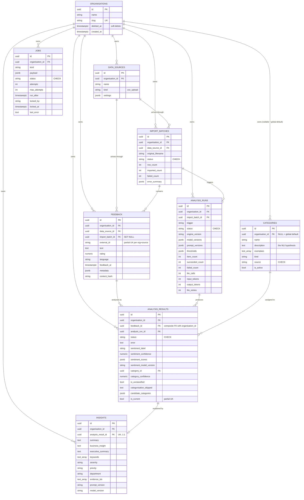

# Milestone 4 — PostgreSQL / Database Layer

**Status:** complete, pending review
**Branch:** `main`
**Preceded by:** [Milestone 3 — Production-Ready Analytics Engine](milestone-03.md)

---

## 1. What this milestone delivers

FeedbackIQ's first persistence layer: nine PostgreSQL tables, an Alembic migration that
builds them from an empty database, a deterministic seed, a set of functions that store
what the analytics engine produces, and 42 integration tests that run against a real
PostgreSQL in CI.

| Added | What it is |
|---|---|
| `src/feedbackiq/db/base.py` | declarative base, constraint naming convention, shared column helpers |
| `src/feedbackiq/db/models.py` | the nine tables, with ownership classification and design reasoning in comments |
| `src/feedbackiq/db/session.py` | one engine per process, `session_scope()` transaction helper |
| `src/feedbackiq/db/persistence.py` | `BatchAnalysis` → rows; plain functions, no repository classes |
| `src/feedbackiq/db/seed.py` | one development organisation + the 24 default categories, idempotent |
| `src/feedbackiq/db/default_categories.json` | the 24-category default taxonomy, shipped **with the package** (see §15) |
| `alembic.ini`, `migrations/` | migration environment and `0001_initial_schema.py` |
| `tests/integration/` | 42 tests against a real PostgreSQL, including the engine/database boundary |
| `docker-compose.yml` | a `postgres:16-alpine` service for local development |
| `.github/workflows/ci.yml` | a `db-test` job with a throwaway PostgreSQL service container |

**Nothing in the API reads or writes the database.** The 22 routes are unchanged, no
ingestion endpoint was added, and the engine is untouched. This milestone builds the
foundation and proves it works; wiring it to HTTP is a later milestone.

---

## 2. Why a database now

The audit ([04-production-gaps](04-production-gaps.md)) found the product had no database
at all. State lived in files: a 427 MB parquet corpus, two 987 MB FAISS indexes, a 430 MB
pickle docstore. That is a defensible shape for a dissertation and an impossible one for a
product — there is nowhere to put a customer's feedback, no way to keep two customers'
data apart, and no record of what the models concluded or which model version concluded it.

Milestone 3 made the engine return typed results (`BatchAnalysis`) instead of dictionaries
assembled for a template. That is the precondition for storing anything sensibly: the
schema can be designed around a known, stable shape rather than around whatever the
dashboard happened to render.

---

## 3. Dependencies

| Package | Version | Why |
|---|---|---|
| `sqlalchemy` | 2.0.51 | ORM and Core. Already installed as a LangChain transitive dependency but declared nowhere — now an explicit runtime dependency, because the product imports it directly. |
| `alembic` | 1.18.5 | Migrations. Same situation: already present via LangChain, now declared. |
| `psycopg[binary]` | 3.2.12 | **The one genuinely new dependency.** PostgreSQL speaks its own wire protocol and nothing in the existing stack can talk it. The `[binary]` extra ships a compiled wheel, so no local C toolchain or `libpq` is needed. |

Nothing was upgraded. No pins changed.

---

## 4. pgvector: investigated, and not adopted

The brief asked whether pgvector is actually required at this milestone, rather than
adopted because it is a common AI/SaaS technology. Five questions, answered with evidence:

**1. Does anything in the product currently persist embeddings?**
No. `grep` across `src/` finds no code that writes an embedding anywhere. Embeddings exist
only as research artefacts under `data/embeddings/` (~2 GB, gitignored) built by
`scripts/build_index.py`.

**2. What performs retrieval today?**
FAISS, through `engine/retrieval.py` → `CorpusRetriever` → `nlp.embeddings.semantic_search`,
reading the on-disk index. Milestone 3 made the retriever an injectable `Retriever`
protocol, so *what* performs retrieval is already a substitution, not a rewrite.

**3. Is the extension even available?**
No. In `postgres:16-alpine`:

```
SELECT count(*) FROM pg_available_extensions WHERE name = 'vector';  ->  0
```

Adopting pgvector therefore means changing the base image (to `pgvector/pgvector:pg16` or
a build step), which is a deployment change, not a dependency addition.

**4. What would it buy right now?**
Nothing that is needed. There are no per-tenant embeddings to store, because there is no
tenant ingestion path yet — that is exactly what this milestone deliberately does not
build.

**5. What is the cost of deferring?**
Low, and the schema does not have to be rewritten to add it. A future `feedback_embeddings`
table with a `vector` column is additive: a new table and a new migration. Nothing designed
here has to change.

**Decision: not now.** The honest reason to add pgvector is "tenant-specific retrieval
needs to be filtered by `organisation_id` inside the database", and that requirement does
not exist until ingestion does. Revisit when per-tenant retrieval is implemented, and
record the measurement that justifies it.

---

## 5. Designing the schema from engine output

The schema was written with `engine/types.py` open. Each stored column traces to a field
the engine actually produces:

| Engine type | Where it goes |
|---|---|
| `FeedbackItem(id, text)` | `feedback` — plus the context a product needs (organisation, source, timestamps) |
| `SentimentPrediction(label, confidence, scores, model_version)` | `analysis_results.sentiment_*` |
| `CategoryMatch(category_id, name, score)` | `analysis_results.category_id` / `category_confidence`, resolved against `categories` |
| `ItemAnalysis(status, is_unclassified, categorisation_skipped, error, ...)` | `analysis_results` |
| `Insight(...)` | `insights` (separate table — see §9) |
| `UsageStats(llm_calls, input_tokens, output_tokens, retries)` | `analysis_runs`, four integer columns |
| `BatchAnalysis.versions` (the Milestone 3 manifest) | `analysis_runs.engine_version` + three JSONB columns |
| `Category(id, name, description, exemplars)` | `categories` |
| `Evidence(...)` | **not stored** — see §9 |

---

## 6. ER diagram



---

## 7. Table reference

| Table | Purpose | Notable constraints |
|---|---|---|
| `organisations` | the tenant root | `slug` unique; `deleted_at` for soft delete |
| `data_sources` | where feedback came from; replaces the dissertation's hard-coded `platform` | unique `(organisation_id, name)` |
| `import_batches` | one upload, so data can be traced to its origin | `status` CHECK; counts stored, not computed |
| `feedback` | customer feedback as received | partial unique `(organisation_id, data_source_id, external_id)`; unique `(organisation_id, id)` to support composite FKs |
| `categories` | the taxonomy the categoriser may assign from | unique per organisation; partial unique among globals; `source` CHECK |
| `analysis_runs` | one processing operation, with the versions that produced it | `status` CHECK |
| `analysis_results` | what the engine concluded about one item | composite FK to `feedback (organisation_id, id)`; partial unique on `is_current`; unique `(analysis_run_id, feedback_id)` |
| `insights` | the LLM's reading of one result | unique `analysis_result_id` (1:1) |
| `jobs` | work to be done later | `status` CHECK; index on `(status, run_after)` |

**UUID primary keys, generated in Python with `uuid4()`.** These identifiers end up in URLs
and API responses; sequential integers would let one customer infer another's record count
and guess identifiers. Generating them in Python means no PostgreSQL extension
(`pgcrypto`/`uuid-ossp`) is required.

**CHECK constraints rather than PostgreSQL `ENUM` types.** Adding a value to an enum needs
its own migration and takes locks; a CHECK is a one-line change. These vocabularies will
grow as the product does. The constraint SQL is generated from the same Python tuple the
code validates against (`_one_of()` in `models.py`), so the two cannot drift apart.

---

## 8. Ownership classification

Every table is classified, as the brief required:

| Classification | Tables | Rule |
|---|---|---|
| **Tenant-owned** | `data_sources`, `import_batches`, `feedback`, `analysis_runs`, `analysis_results`, `insights`, organisation-owned `categories` | `organisation_id` is `NOT NULL`; every lookup index leads with it |
| **Global / reference** | `categories` where `organisation_id IS NULL` | the seeded 24-category default taxonomy, shared and read-only for customers |
| **System / internal** | `jobs` (scoped to an organisation), `alembic_version` | the application's own bookkeeping |

Two mechanisms make tenant isolation enforceable rather than aspirational:

1. **`organisation_id` on every tenant table**, so the eventual tenancy middleware has a
   single column to filter on.
2. **A composite foreign key.** `analysis_results (organisation_id, feedback_id)` references
   `feedback (organisation_id, id)`. A plain `feedback_id` column would happily accept a row
   where the organisation and the feedback belong to different tenants — a bug that shows up
   as one customer reading another's analysis. The database refuses it instead, and
   `test_a_result_cannot_point_at_another_organisations_feedback` proves it does.

**No authentication, sessions, roles or access checks exist yet.** That is deliberate and
is the next milestone's work. What exists here is the structure those checks will use.

Organisation deletion was tested, not assumed: deleting an organisation row cascades to its
feedback (verified — the `RESTRICT` on `feedback.data_source_id` does not block it, because
PostgreSQL resolves the cascade before the restrict check). The intended offboarding path
is still the soft delete (`deleted_at`), because stopping access and destroying data are
different decisions.

---

## 9. Normalised columns vs JSONB

The rule applied: **a column if it is filtered, grouped or aggregated; JSONB if it is read
as a block.**

| Data | Choice | Why |
|---|---|---|
| sentiment label, confidence | columns | every dashboard question filters or groups by these ("negative feedback this month") |
| `sentiment_scores` (three floats) | JSONB | read together when explaining one result; nothing filters on "neutral score > 0.2" |
| category, category confidence | columns (FK) | grouped by constantly; an FK also guarantees the category exists |
| `candidate_categories` (near-misses) | JSONB | an audit trail, variable length, never filtered |
| usage (4 integers) | columns | metering must `SUM` these per organisation and month |
| `engine_version` | column | "everything produced by engine 1.0.0" is a real question |
| model / prompt versions, thresholds | JSONB | read as a block when explaining a result; shape varies by engine version |
| `feedback.metadata` (product, region, plan…) | JSONB | keys differ per organisation; a column per key is impossible |
| `import_batches.error_summary` | JSONB | row-level problems, variable shape, nothing queries inside it |

**Deliberately not over-normalised.** There is no `sentiment_labels` lookup table for three
strings, no `departments` table for a field the LLM writes freely, and no EAV table for
`metadata`. Each would add a join to every query and buy nothing.

**`ItemAnalysis.evidence` is not persisted.** Retrieval output is high-volume (RAG_TOP_K
rows per item) and its value expires the moment the answer exists. What the LLM was actually
shown is recorded as `insights.evidence_ids` — which is the traceability property the
dissertation measured (RQ4), at a fraction of the storage.

**`insights` is a separate table, not more columns on `analysis_results`,** for three
reasons: it is optional (bulk analysis runs without an LLM, so most results have none), it
is generated separately and can be regenerated, and it carries its own prompt and model
versions. Keeping it apart leaves the result row narrow for the aggregate queries that run
constantly.

---

## 10. Analysis-run versioning

No new versioning scheme was invented. `analysis_runs` stores the manifest Milestone 3
already produces (`engine/versions.py` → `BatchAnalysis.versions`):

```
engine_version    "1.0.0"
model_versions    {"sentiment_model": "distilbert-finetuned-final@<digest>",
                   "categoriser_model": "...deberta-v3-base-zeroshot-v2.0",
                   "embedding_model": "all-MiniLM-L6-v2",
                   "llm_model": "openai/gpt-oss-20b"}
prompt_versions   {"item_analysis": "item-analysis-2026-09", ...}
thresholds        {"category_confidence": 0.35, ...}
```

This is what makes "why does this row disagree with that one?" answerable: two results with
different sentiment for similar text can be traced to different model digests or a changed
threshold.

**Re-analysis supersedes rather than overwrites.** `analysis_results.is_current` marks the
row a dashboard should read; a new run adds rows and clears the previous `is_current`.
History is kept, so a model upgrade does not silently rewrite what a customer saw last
month. The partial unique index `uq_analysis_results_current_feedback` (`feedback_id WHERE
is_current`) makes "exactly one current result per item" a database guarantee — the
persistence layer *must* clear the old flag, and cannot forget to.

---

## 11. Feedback: minimal by design

`feedback` stores the text, an optional rating, an optional language, when the customer
wrote it, and free-form `metadata`. Deliberately **not** stored:

- **`cleaned_text`.** Derived data. Milestone 3 established that the engine normalises at
  serve time; storing a derivative invites the two drifting apart.
- **Model predictions.** Those are analysis results, not input. (The dissertation corpus's
  `sentiment_label` column was a *rating-derived* label, not a prediction — storing it on
  the input row is part of what made the old dashboard misleading.)
- **Author names, emails, handles, IP addresses.** Personal data the product does not need
  in order to analyse feedback. A caller who must identify a reviewer puts an opaque
  reference in `metadata`. Collecting less is the cheapest privacy measure available, and it
  keeps a future DPA conversation short.

`content_hash` (SHA-256 of the normalised text) is stored and indexed so a re-uploaded file
can be detected. It uses the engine's own `normalise_text`, so "the same text" means one
thing in the whole system. Nothing is de-duplicated automatically — the same sentence twice
may be two genuine complaints; that is the caller's decision to make.

---

## 12. Categories, and organisation taxonomies later

One nullable column carries the whole story:

- `organisation_id IS NULL` → the seeded default taxonomy (the dissertation's 24 complaint
  categories), shared by every organisation.
- `organisation_id IS NOT NULL` → that organisation's own categories.

An organisation-specific taxonomy therefore needs **no schema change**: the customer's rows
are inserted with their id, the engine receives whichever set the caller passes
(`analyse_batch(categories=...)`, already true since Milestone 3), and
`_resolve_category_id` prefers the organisation's own row over a global one of the same name.

Two constraints are needed because PostgreSQL treats `NULL`s as distinct: a normal unique
constraint on `(organisation_id, name)` for organisation-owned rows, and a *partial* unique
index on `name WHERE organisation_id IS NULL` for the globals.

`description` is `NOT NULL` because it is functional, not documentation — it is the NLI
hypothesis the zero-shot model compares against.

**No category-management UI or API was built.** Not asked for, and not needed to prove the
schema supports it.

---

## 13. Data sources, import batches, and the jobs table

**`data_sources`** replaces the dissertation's hard-coded `platform` column
(amazon/yelp/twitter_airline), which is meaningless for a customer's own feedback. `kind` is
`csv_upload` today; `settings` (JSONB) holds per-source configuration for future
integrations. No integration is implemented.

**`import_batches`** records one upload: filename, a `storage_reference` (a path or object
key — the file itself never goes in the database), status, and three counts. The counts are
stored rather than computed because they describe what happened at import time, which a
later `COUNT(*)` cannot reconstruct after de-duplication.

**`jobs`** is the simplest thing that could work: a table, a status, a retry counter, a
`run_after` timestamp. **No queue, no broker and no worker exist in this milestone.** What a
future worker will do: claim a `queued` row with `SELECT ... FOR UPDATE SKIP LOCKED`, run
the engine over the import batch named in `payload`, write `analysis_results`, and mark the
row `succeeded` or `failed`. Keeping the queue in PostgreSQL is one fewer moving part than
Redis or a broker, and it is transactional with the data it describes. `payload` holds
identifiers only — never feedback text, which would duplicate customer data into a second
place.

---

## 14. Migrations, and how the migration was verified

Alembic, with the connection URL read from `settings.DATABASE_URL` in `migrations/env.py`
rather than written into `alembic.ini` — a connection string carries a password and does not
belong in the repository.

`migrations/versions/0001_initial_schema.py` was generated with
`alembic revision --autogenerate --rev-id 0001`, then read line by line and annotated. The
autogenerated "please adjust" banners were replaced with an explanation of what the file
creates and which constraints matter.

A constraint naming convention (`db/base.py`) makes autogenerate deterministic: without it,
PostgreSQL invents names that differ from SQLAlchemy's, and every subsequent migration diff
is noise. It also makes a violation readable in a log — `uq_feedback_org_source_external`
says what went wrong.

Verified against real PostgreSQL 16.15, not assumed:

| Check | Result |
|---|---|
| empty database → `alembic upgrade head` | all 9 tables + `alembic_version` |
| partial indexes carried by the migration | `WHERE (external_id IS NOT NULL)`, `WHERE (organisation_id IS NULL)`, `WHERE is_current` — all three present |
| composite FK carried | `fk_analysis_results_org_feedback (organisation_id, feedback_id) → feedback (organisation_id, id)` |
| CHECK constraints carried | 5 (`import_batches`, `analysis_runs`, `analysis_results`, `categories`, `jobs`) |
| `alembic check` | "No new upgrade operations detected" — the migration matches the models |
| `alembic downgrade base` | back to `alembic_version` only |
| re-`upgrade head` | full schema again |

`alembic check` is also a test (`test_the_migration_still_matches_the_models`), so a model
edited without a migration fails CI instead of surfacing in production.

---

## 15. Seed data

`python -m feedbackiq.db.seed` creates one development organisation (`slug="dev"`), one
`csv_upload` data source, and the 24 default categories as global rows.

- **Deterministic and idempotent.** Rows are identified by natural keys (the slug, the
  category name), so a second run reports `0, 0, 0` and changes nothing. Safe to run after
  every migration.
- **The 642,692-review corpus is not imported.** It is research data measured in gigabytes;
  a development database needs none of it, and a test suite that loaded it would be
  unusable. `test_the_seed_does_not_import_the_dissertation_corpus` keeps that honest.

### The taxonomy ships with the package (a defect CI caught)

The seed originally read the taxonomy from `feedbackiq.nlp.categoriser.COMPLAINT_CATEGORIES`,
on the reasoning that the dissertation's own file should be the single definition. **CI
failed, and it was right to.** That constant is loaded at import time from
`data/processed/complaint_categories_all_negative.json`, which is:

- gitignored (`/data/` in `.gitignore`), so it does not exist in a fresh clone, and
- excluded from both container images (`data/` in `.dockerignore`).

When the file is absent, `nlp/categoriser.py` falls back to **7 static categories** with a
warning. So the seed installed 7 categories in CI — and would have installed 7 in any
deployed container — while every document and test claimed 24. Locally it looked perfect,
because locally the research data is present. This is the same class of defect CI found in
Milestone 1 (`backend/models/` matched by an unanchored ignore rule).

The fix: the 24 categories are now **product reference data, shipped inside the package** as
`src/feedbackiq/db/default_categories.json` (7,133 bytes), declared in
`[tool.setuptools.package-data]` so it is installed with the wheel and present in the image.

> **Superseded by [Milestone 5A](milestone-05a.md).** That file moved to
> `src/feedbackiq/core/default_categories.json` (the engine must read it too, and the engine
> may not import `feedbackiq.db`), gained version and provenance metadata, and is now read
> through `core/taxonomy.py` by the engine, the seed *and* `nlp/categoriser.py`.
It is generated from the dissertation's output and trimmed to the three fields the product
uses — `category`, `description`, `exemplars` — leaving the research fields (`count`,
`keywords`, `platforms`, `source_labels`, `source_topic_ids`) in the dissertation's own file.
Provenance was verified: names, descriptions and exemplars are identical to the source, in
the same order.

`tests/unit/test_default_taxonomy.py` guards it from the **unit** suite, not the database
suite, so a bare `pytest` catches a missing or malformed packaged file — no PostgreSQL
required to detect a packaging mistake. A clean-clone simulation (pointing `TAXONOMY_DIR` at
an empty directory) confirms the seed now returns 24 categories with `data/` absent.

Note what was *not* changed: `nlp/categoriser.py` still loads its own copy the old way, so
**serving behaviour is untouched**. That leaves a real pre-existing defect — in the container
image the categoriser silently categorises against 7 fallback categories instead of 24 —
recorded in the limitations below rather than fixed silently here.

---

## 16. The persistence layer, and the engine/database boundary

**Plain functions taking a `Session`, not repository classes.** A repository earns its keep
when there are several implementations to swap or a domain model to keep separate from the
tables. Here there is one database and the models *are* the domain model, so a class per
table would be indirection with nothing behind it. When a second caller needs the same
query, it imports the function. (`claude.md`: no abstraction without a concrete need.)

```python
with session_scope() as session:
    rows = save_feedback(session, organisation_id=org.id, data_source_id=src.id,
                         texts=["the app keeps crashing"])
    analysis = engine.analyse_batch([FeedbackItem(id=str(rows[0].id), text=rows[0].text)])
    save_batch_analysis(session, organisation_id=org.id, analysis=analysis)
```

`save_batch_analysis` maps one `BatchAnalysis` to one run row, one result row per item, and
an insight row where the LLM produced one. `ItemAnalysis.feedback_id` must be a `feedback.id`
— the engine echoes back whatever identifier the caller gave it, and *this* is the layer that
knows those identifiers are database rows. A non-UUID id raises a clear `ValueError` rather
than being silently dropped.

**The boundary, stated as a rule:** the engine does not know the database exists.

```
feedbackiq.engine  ──▶  typed results  ──▶  feedbackiq.db  ──▶  PostgreSQL
     (no SQL)                                  (all the SQL)
```

Three tests enforce it (`test_engine_db_boundary.py`), because a boundary that is only a
convention erodes the first time someone finds a query convenient:

1. An AST scan of every module in `engine/` for imports of `sqlalchemy`, `alembic`,
   `psycopg`, `feedbackiq.db` or `fastapi`.
2. A subprocess that imports `feedbackiq.engine` in a fresh interpreter and asserts no
   database library reached `sys.modules` — which catches a lazy import inside a function
   that the AST scan would miss.
3. The engine producing a full result with `DATABASE_URL` set to `""`, then that result
   being stored by the persistence layer — the hand-off, end to end.

The dependency runs one way only: `db/persistence.py` imports the engine's *types* (and its
`normalise_text`) to read them. The engine imports nothing from `db/`.

---

## 17. Indexes, and the queries they serve

Every index exists for a stated access pattern; none was added speculatively.

| Index | Query it serves |
|---|---|
| `ix_feedback_organisation_id_feedback_at` | the dashboard's main view: one organisation's feedback, newest first |
| `ix_feedback_organisation_id_content_hash` | "have we seen this text before?" during import |
| `ix_feedback_import_batch_id` | everything that arrived in one upload |
| `ix_analysis_results_organisation_id_sentiment_label` | sentiment breakdown per organisation |
| `ix_analysis_results_organisation_id_category_id` | complaint categories per organisation |
| `uq_analysis_results_current_feedback` | the current result per item (and the guarantee there is only one) |
| `ix_analysis_runs_organisation_id_created_at` | run history, newest first |
| `ix_insights_organisation_id_severity` | triage: high-severity insights first |
| `ix_jobs_status_run_after` | how a future worker finds its next piece of work |

No partitioning, no materialised views, no read replicas: there is no measured volume
problem yet, and each would be a commitment made on a guess. `feedback` is the table to
watch — it is the one that grows per customer per upload.

---

## 18. Verification, tests, CI, and what was not done

### Test results (measured, not estimated)

| Suite | Result |
|---|---|
| Existing suite (`pytest`) | **248 passed, 2 xfailed** — the 244 from Milestone 3, plus 4 new packaged-taxonomy tests; no existing test changed behaviour |
| Database suite (`pytest tests/integration`) | **42 passed** against PostgreSQL 16.15 |
| Clean-clone simulation (`TAXONOMY_DIR` empty) | seed returns **24** categories, not the 7 fallback |
| `flake8 src frontend migrations tests/... --select=E9,F` | clean |
| Backend image (`docker build --output type=cacheonly`) | exit 0 |
| Frontend image | exit 0 |
| API surface | `feedbackiq.api.main` imports, **22 routes** — unchanged |
| `alembic upgrade head` + `python -m feedbackiq.db.seed` on the dev database | 1 organisation, 1 data source, 24 global categories; second run 0/0/0 |

What the 42 database tests cover:

| File | Protects |
|---|---|
| `test_migrations.py` (6) | empty database → full schema; downgrade and re-upgrade; `alembic check`; one recorded version; partial indexes and the composite FK survive |
| `test_tenant_data.py` (13) | organisation ownership; a result cannot reference another organisation's feedback; duplicate `external_id` rules; global vs organisation taxonomy uniqueness; CHECK rejection |
| `test_persistence.py` (17) | run versions and usage; result columns and JSONB; category resolution by name and by scope; unclassified and gate-skipped results; failed items; re-analysis history; insight 1:1; rollback |
| `test_seed.py` (5) | development organisation, 24 categories, idempotency, no corpus |
| `test_engine_db_boundary.py` (4) | the engine imports no database library, loads none at runtime, runs with no database, and its output stores cleanly |

No mocking anywhere in this suite. If PostgreSQL is unreachable these tests **fail rather
than skip** — a suite that skips itself reports green while testing nothing.

### CI

Four sequential jobs: **lint → test → db-test → docker-build**. The new `db-test` job runs a
`postgres:16-alpine` service container, migrates an empty database, runs the seed, then runs
`pytest tests/integration`. Its credentials are created by and for that runner, live for one
job, and are unreachable from outside it — no repository secret is involved and no real
database is touched. Lint now also covers `migrations/` and `tests/integration`.

`tests/integration` is deliberately **not** in `testpaths`: a bare `pytest` must stay
runnable by anyone who has only cloned the repository.

**CI earned its keep on this milestone.** The first push (`c0ea547`) passed lint and the unit
suite and failed `db-test`: 4 failed, 38 passed, with the seed installing 7 categories
instead of 24. That is a defect no amount of local testing would have found, because the
cause was a file that exists on my machine and nowhere else (§15). The suite was not
weakened to accommodate it — the product was fixed and a unit test added so the same mistake
fails faster next time.

### Dissertation artefacts

Nothing under `data/`, `models/`, `notebooks/`, `evaluate/` or `scripts/` was modified, and
no dissertation methodology was touched. `git status` shows only the files this milestone
added or edited.

**One honest correction.** Milestones 2 and 3 verified the evaluation outputs by a combined
md5 of `data/results/metrics_summary/`, which I reported as
`c0f5893568f772213e8d4c38ca8146d4`. That value appears in no document, and recomputing it
three plausible ways today gives three different results — so the exact command that
produced it is not recoverable and **I cannot claim a match**. What is verifiable: those four
files were last written at 18:00 on 12 Sep 2026 (during Milestone 3's own verification,
before any Milestone 4 artefact — the migration is stamped 21:15), and no Milestone 4 code
path writes to `data/`. The per-file hashes are recorded here as a reproducible baseline:

```
87e0789a92e80cc6512ae1a7863f039d  confusion_counts.csv
7902a056ba0f41246d20ab03e606fbc4  overall_metrics.csv
8cb719423bbbe27aa9dd2a55ea1ce7d1  per_class_metrics.csv
cf7a520f580862523ff411b88a9f362d  significance_tests.csv
```

Future milestones should compare these four values individually, not a combined digest whose
recipe can be lost.

### Deliberately not done

Authentication, login, sessions, JWT, organisation invitations, RBAC, tenant access
middleware; Stripe or billing; React; background workers; cloud deployment; Kubernetes;
microservices; event buses; pgvector (§4); any API route that reads or writes the database;
ingestion endpoints; a category-management UI; importing the dissertation corpus. The
`AnalyticsEngine` was not redesigned and contains no database logic.

### Known limitations

| # | Limitation |
|---|---|
| 1 | **Nothing uses the database yet.** The API, the dashboard and the engine all behave exactly as they did in Milestone 3. Until ingestion exists, the schema is proven but idle. |
| 2 | **No tenant enforcement at runtime.** `organisation_id` and the composite FK make isolation *enforceable*; nothing yet *enforces* which organisation a request may read. That is the authentication/tenancy milestone. |
| 3 | **`jobs` has no worker.** Rows can be written; nothing claims them. |
| 4 | **Hard delete of an organisation is untested beyond the cascade probe.** Soft delete (`deleted_at`) is the intended offboarding path, and no purge job exists. |
| 5 | **No connection-pool tuning under load.** `pool_size=5, max_overflow=5, pool_pre_ping=True` are defensible defaults chosen without measurement. |
| 6 | **`feedback.rating` is `Numeric(3,1)`**, which assumes a numeric scale. A 👍/👎 or NPS-style source will need either a convention or another column. |
| 7 | ~~**`nlp/categoriser.py` still degrades silently.**~~ **Fixed in [Milestone 5A](milestone-05a.md).** It loaded its taxonomy from gitignored `data/processed/`, so inside the container image it categorised against 7 static fallback categories instead of 24. The `_STATIC_FALLBACK` is deleted, the engine and the categoriser now read the same canonical packaged taxonomy as the seed, and a missing taxonomy raises `TaxonomyError`. |

---

## Next

Milestone 5 as scoped by the roadmap ([07-production-roadmap.md](07-production-roadmap.md)).
The two obvious candidates are (a) authentication, organisations and tenant enforcement, or
(b) an ingestion path that makes the schema live. **Awaiting approval before starting
either.**
